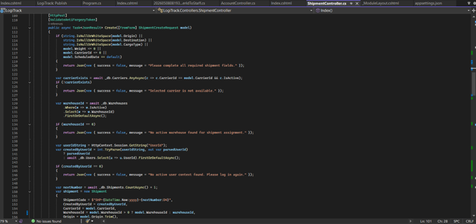
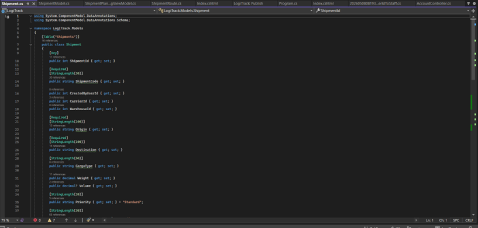
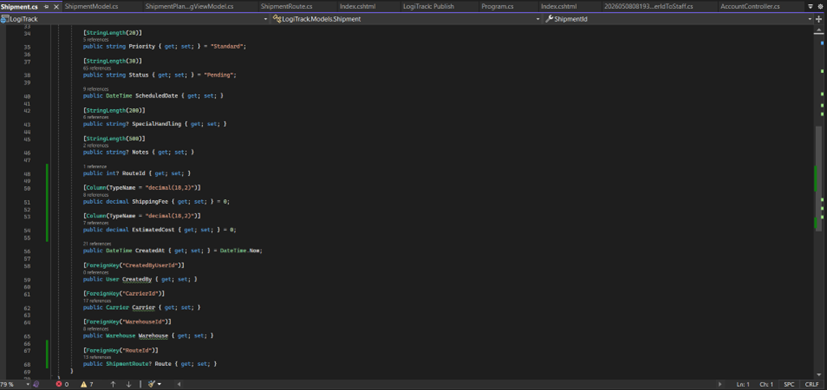

# LogiTrack — Prototype screen documentation (source-backed)

This document pairs **labeled figures** (clear screenshots) with the **APIs and algorithms** that implement the showcased functionality. Figures are stored under `docs/prototype-screenshots/` in this repository.

---

## Figure 1 — `ShipmentController`: create shipment (POST pipeline)

**Label:** *Figure 1 — Shipment API: `Create` action (validation, carrier check, session user, code generation)*

**Screen / code shown:** `LogiTrack.Controllers.ShipmentController.Create` — HTTP POST handler that accepts form-bound `ShipmentCreateRequest`, validates input, verifies related data, and persists a new `Shipment`.

### APIs and their roles

| API / technology | Role in this functionality |
|------------------|------------------------------|
| **ASP.NET Core MVC** | `[HttpPost]`, `[ValidateAntiForgeryToken]`, `[FromForm]` — accepts browser/`fetch` form posts securely and binds fields to `ShipmentCreateRequest`. |
| **`JsonResult` + anonymous JSON** | Returns `{ success, message, … }` for AJAX clients (e.g. Shipment Planning UI) without a full page reload. |
| **`HttpContext.Session`** | Reads `UserId` from session to stamp `CreatedByUserId`; falls back to a DB user only if session parsing fails (defensive default). |
| **Entity Framework Core** | **`AnyAsync`** on `Carriers` — ensures `CarrierId` exists and is active before insert. **`FirstOrDefaultAsync`** / **`Select`** on `Warehouses` — picks a default active warehouse id when needed. **`CountAsync`** on `Shipments` — drives the next sequence number for `ShipmentCode`. **`Add`** + **`SaveChangesAsync`** — inserts the entity and commits the transaction. |
| **LINQ (IQueryable)** | Composes filters (`Where`, `Select`) server-side; translated to SQL by EF Core. |

### Algorithms / logic

1. **Required-field gate** — Rejects early if origin, destination, cargo type, weight, carrier, or scheduled date are missing/invalid (constant-time checks, no DB round-trip).
2. **Referential sanity** — Active carrier existence check prevents orphaned `CarrierId` rows.
3. **Shipment code generation** — `nextNumber = Count() + 1`, format `SHP-{currentYear}-{nextNumber:D4}` (padded 4-digit suffix). *Note:* concurrent creates can theoretically collide; production systems often use DB sequences or unique constraints + retry.
4. **Warehouse resolution** — Uses submitted `WarehouseId` when `> 0`, otherwise first active warehouse from the database.

**Primary source file:** `Controllers/ShipmentController.cs`

---

## Figure 2 — `Shipment` entity: core identifiers and route/cargo fields

**Label:** *Figure 2 — Domain model: `Shipment` class (keys, route, cargo, scheduling attributes)*

**Screen / code shown:** `LogiTrack.Models.Shipment` — EF Core–mapped class with data annotations describing columns and constraints.

### APIs and their roles

| API / technology | Role in this functionality |
|------------------|------------------------------|
| **`[Table("Shipments")]`** | Maps the CLR type to the relational table name used by migrations and queries. |
| **Data annotations** (`[Key]`, `[Required]`, `[StringLength]`, `[ForeignKey]`) | Declarative validation hints and schema metadata consumed by EF Core migrations and (where enabled) MVC model validation. |
| **Navigation properties** (`User`, `Carrier`, `Warehouse`, …) | Enable **`Include`** / eager-loading graphs in LINQ (e.g. `Index` listing with carrier and warehouse names). |

### Algorithms / logic

- **Default literals** on `Priority` and `Status` — new instances start as `"Standard"` / `"Pending"` unless overridden by application code (as `Create` does for status).
- **Relational model** — `CarrierId`, `WarehouseId`, `CreatedByUserId` link to parent tables for joins and referential integrity (enforced at DB level when FKs exist).

**Primary source file:** `Models/Shipment.cs`

---

## Figure 3 — `Shipment` entity: financials, audit fields, and relationships

**Label:** *Figure 3 — Domain model: `Shipment` financial columns, timestamps, and navigation graph*

**Screen / code shown:** Continuation of `Shipment` — monetary fields with SQL precision/scale, `CreatedAt` default, and navigation properties for EF relationships.

### APIs and their roles

| API / technology | Role in this functionality |
|------------------|------------------------------|
| **`[Column(TypeName = "decimal(18,2)")]`** | Fixes `ShippingFee` / `EstimatedCost` precision in SQL Server migrations (money-like fields). |
| **`DateTime.Now` default on `CreatedAt`** | Sets row creation timestamp at materialization time in the application layer (distinct from DB `GETDATE()` defaults, if any). |
| **EF relationship fluent behavior (via attributes)** | `[ForeignKey]` pairs scalar FKs to navigations (`Carrier`, `Warehouse`, `Route`, `CreatedBy`) so EF can traverse graphs and enforce association semantics. |

### Algorithms / logic

- **Financial snapshot on the row** — `ShippingFee` and `EstimatedCost` are denormalized on `Shipment` for reporting and UI (e.g. profit on the Shipment Planning detail drawer) without recomputing from rate cards at read time.
- **Graph loading pattern** — Controllers use `Include` / `Select` projections (see `ShipmentController.Index`) to hydrate only the data needed for list and detail views.

**Primary source file:** `Models/Shipment.cs`

---

## Related client functionality (not shown in figures)

These APIs support the **Shipment Planning** Razor + Alpine.js UI but are not visible in the above IDE captures:

| Endpoint / surface | Role |
|----------------------|------|
| **`GET /Shipment/Index`** | Builds `ShipmentPlanningViewModel` (KPI counts, paged list, carriers, warehouses, rate cards). Uses EF **`Include`**, **`CountAsync`**, **`OrderByDescending`**, **`Take`**. |
| **`POST /Shipment/Create` (JSON)** | Same as Figure 1 — consumed by `fetch` from the slide-over form. |
| **Client-side `fetch` + `FormData`** | Submits multipart form fields and anti-forgery token header expected by `[ValidateAntiForgeryToken]`. |
| **Alpine.js** | Reactive filters, sort (DOM reorder by `data-code`), and drawers without SPA framework overhead. |
| **Optional freight heuristic** (UI) | Uses serialized `RateCards` to estimate cost from weight, carrier, zone/priority — implemented in `Views/Shipment/Index.cshtml` script (`calculateFinancials`), not server-side optimization. |

---

## File index

| File | Path |
|------|------|
| This document | `docs/PROTOTYPE_SCREEN_DOCUMENTATION.md` |
| Figure 1 image | `docs/prototype-screenshots/figure-01-shipment-controller-create.png` |
| Figure 2 image | `docs/prototype-screenshots/figure-02-shipment-entity-core-fields.png` |
| Figure 3 image | `docs/prototype-screenshots/figure-03-shipment-entity-financials-and-relations.png` |

When exporting to PDF or a learning management system, embed these three PNGs inline next to their **Figure** headings so each prototype screen has a **clear screenshot** and **label name** as required.
